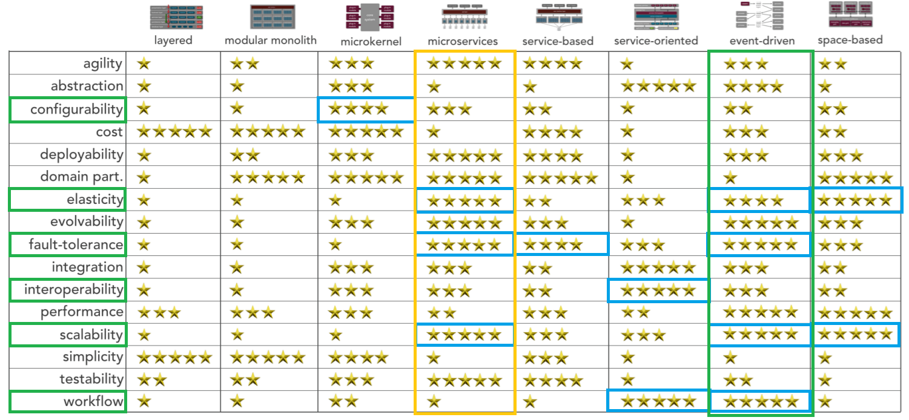

[> Home](../README.md)    [> Solution Background](README.md)

---

# Overall Architecture Style Analysis

## Identified Key Architectural Characteristics

The [key architectural characteristics](../1.ProblemBackground/ArchitectureAnalysis.md) that were identified help us to select and overall architecture style.

- **Interoperability**
- Data Integrity
- Scalability/Elasticity
- **Configurability**
- **Authorisation**
- Workflow
- Fault Tolerance

## Architecture Capabilities Comparison

The above characteristics are highlighted below in green, with data integrity, above, not included in the matrix below.

[original comparison matrix from [DeveloperToArchitect.com](https://www.developertoarchitect.com/downloads/worksheets.html)]

## Architecture Capabilities Analysis

The above matrix gives us two candidates for our architecture:

### Microservices

- Scores low on configurability and workflow, which would be a big trade-off with configurability being one of the top 3 characteristics.
- Requires that the database be split along with each microservice. This would be very complex and another big trade-off.
- Also scores badly on cost and simplicity. Not key characteristics, but likely to be important to management and lead technologists respectively.

### Event-Driven

- Interoperability and configurability score fairly low, which is a concern with them being two of the top three characteristics.
- Fault-tolerance, elasticity, scalability and workflow all score highly, four of the seven characteristics.

## Conclusion

All three options have trade-offs, but the trade-offs for the Service-Based architecture can be mitigated by using containerisation, a scalable graph database, orchestrator services, and employing queues where needed.

### Decision

ADR: [002 We-will-use-a-Service-Based-backend-architecture](../4.ADRs/002We-will-use-a-Service-Based-backend-architecture.md)

---

[> Home](../README.md)    [> Solution Background](README.md)